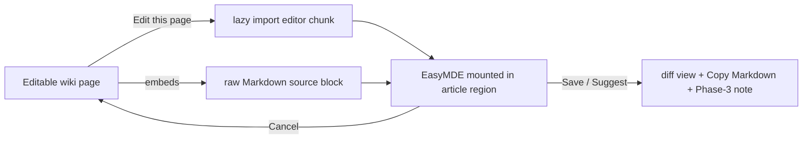

# OpenFront Wiki — Phase 2: Inline Edit UI (Design)

**Date:** 2026-08-12
**Status:** Approved. Second phase of the community-editing project (see `2026-08-12-community-editing-design.md`). Builds on Phase 1 (content is now per-page Markdown in `src/content/wiki/`).

## Summary

Add an inline Markdown **editing experience** to each editable wiki page: an "Edit this page" button that swaps the article into a full-featured Markdown editor (EasyMDE) with a formatting toolbar, syntax highlighting, and live preview, pre-loaded with the page's own Markdown. The editor library is lazy-loaded on first click so reading pages stay fast. Since the Discord/GitHub backend is Phase 3, **saving is stubbed**: "Save / Suggest edit" shows a diff of the changes plus a Copy-Markdown action and a note that submitting goes live in Phase 3.

## Goals

- Anyone on an editable page can open a real Markdown editor pre-loaded with that page's source.
- The editor is genuinely usable by non-technical contributors (toolbar + live preview).
- Reading pages stay as fast as today — editor code loads only on demand.
- The phase is demonstrable end-to-end except the network submit (which Phase 3 adds).
- Everything stays static and self-contained (no CDN, no external calls); site keeps deploying on Cloudflare Pages unchanged.

## Non-goals (Phase 3 owns these)

- Discord authentication and the trusted-vs-suggest distinction.
- Any actual saving, commit, PR, or suggestion submission.
- Moderation / review queue.
- Editing OpenFront Masters pages (they remain a Liquipedia mirror; no Edit button).

## Architecture

Inline edit-in-place. On an editable page (`kind === "wiki"` in `[slug].astro`), an **"Edit this page"** control sits near the title. Clicking it:

1. Lazy-loads the editor module (dynamic `import()` → Vite code-splits EasyMDE + its CSS into a separate chunk fetched only now).
2. Reads the page's raw Markdown from an embedded source block, hides the rendered article, and mounts EasyMDE in its place.
3. On **Cancel/Done**, unmounts the editor and restores the article.
4. On **Save / Suggest edit** (stub), computes a diff of edited-vs-original and shows it with a Copy-Markdown button and the Phase-3 note.

## Components (each with one clear responsibility)

- **Edit control** (in `[slug].astro`, wiki kind only): the button + the container the editor mounts into; renders only for `kind === "wiki"`.
- **Embedded source** (in `[slug].astro`): the page's `entry.body` written into a hidden, inert block (e.g. `<script type="text/markdown" data-page-source>` — inert script type, not executed) so the editor can read the exact Markdown without a network call.
- **Editor controller** (`src/scripts/editor.ts` or similar, client, lazy): orchestrates open/close — reads the source block, dynamically imports EasyMDE, mounts/unmounts it, and swaps article ↔ editor visibility. This is the only module that imports EasyMDE, so EasyMDE lands in its own lazy chunk.
- **Diff + submit stub** (same controller or a sibling module): computes a line diff (edited vs original), renders it, provides Copy-Markdown, and shows the "goes live in Phase 3" note. Kept as a seam Phase 3 replaces with a real POST.
- **Editor styles**: EasyMDE's bundled CSS plus a small override so its preview pane uses the site's `.wiki-content` look and the toolbar/theme match the dark palette.

## Editor library — EasyMDE

EasyMDE is chosen for a batteries-included editor at low build cost: toolbar (bold/italic/link/heading/list/preview), Markdown syntax highlighting, and side-by-side live preview out of the box, installed as an npm dependency and **bundled** (no CDN). Alternative considered: CodeMirror 6 — more modern and lighter-core, but the toolbar and preview would be hand-built for the same Phase-2 outcome; deferred. EasyMDE's preview renderer can be pointed at the site's styles; if its default Markdown rendering drifts too far from Astro's, we can supply a custom `previewRender` later.

## Data flow & source loading

The rendered HTML (`<Content />`) stays as the reading view. Separately, `[slug].astro` embeds `entry.body` (the raw Markdown) verbatim in the inert source block. The editor controller reads that block's text content on open — so editing starts instantly with the exact source, no fetch. (Masters pages embed nothing and show no Edit button.)

## Live preview

EasyMDE's live preview pane, restyled with `.wiki-content` so it approximates the real page. This is a client-side Markdown render (EasyMDE uses `marked`), which will not perfectly reproduce Astro's remark/rehype pipeline (explicit heading ids, raw-HTML passthrough, GFM nuances) — acceptable for a preview. Fidelity gaps that matter can be narrowed later via a custom `previewRender`.

## Submit stub (Phase 3 replaces)

"Save / Suggest edit" does not touch the network. It:
- computes and shows a readable diff of the edited Markdown vs the original,
- offers **Copy Markdown** (clipboard) of the edited source,
- shows a clear note: *"Editing isn't live yet — Phase 3 adds Discord sign-in and review so this can be saved/suggested."*

This is the exact seam Phase 3 swaps for: capture edited Markdown + page slug → POST to the backend (trusted → commit; public → suggestion). Nothing else about Phase 2 changes then.

## Error handling

- If the lazy import fails (offline/CDN-less build error), the button shows an inline "editor failed to load" message and the article stays intact.
- Empty/whitespace-only edits: Save is disabled or warns; nothing destructive can happen (no save exists yet).
- Clipboard copy failures fall back to selecting the textarea content.

## Testing

- **Unit-testable (`node --test`):** the diff computation (edited vs original → expected diff lines) and any source-extraction/normalization helper (e.g. trimming the embedded block, unescaping) — pure functions in `src/lib/`.
- **Build/integration:** a wiki page's built HTML contains the Edit control + the embedded source block and matches `entry.body`; a Masters page has neither. EasyMDE lands in a separate lazy chunk (reading-page JS unchanged).
- **Manual:** open editor, toolbar/preview work, Cancel restores, Save shows diff + copy. (The interactive editor itself is verified manually / via the browser preview.)

## Constraints

- Static site on Cloudflare Pages; no external hosts (EasyMDE + CSS bundled).
- Editor code must NOT ship in the reading-page bundle — only via the lazy chunk fetched on Edit.
- Edit control on `kind === "wiki"` pages only; never on Masters.
- Keep `[slug].astro` focused; put editor logic in its own client module(s), not inline in the route.

## Risks

- **Preview fidelity** — EasyMDE's `marked`-based preview approximates, not matches, the site render. Mitigation: `.wiki-content` styling now, custom `previewRender` if needed.
- **EasyMDE maintenance** (built on CodeMirror 5) — acceptable for Phase 2; the editor lives behind one controller module, so swapping to CodeMirror 6 later is contained.
- **Bundle size** — mitigated by lazy loading (zero cost until Edit is clicked).
